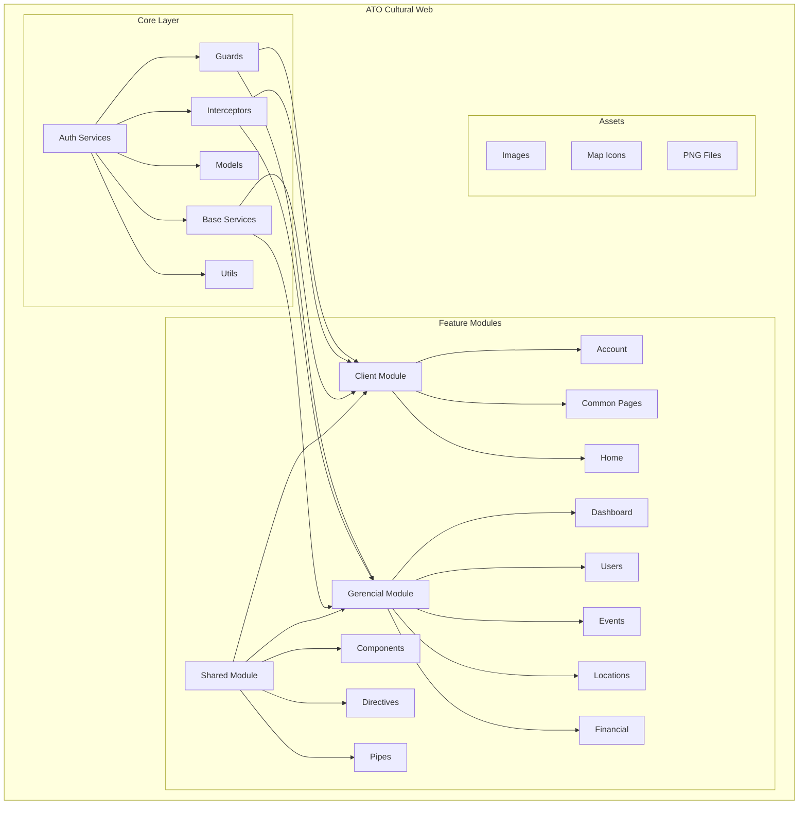
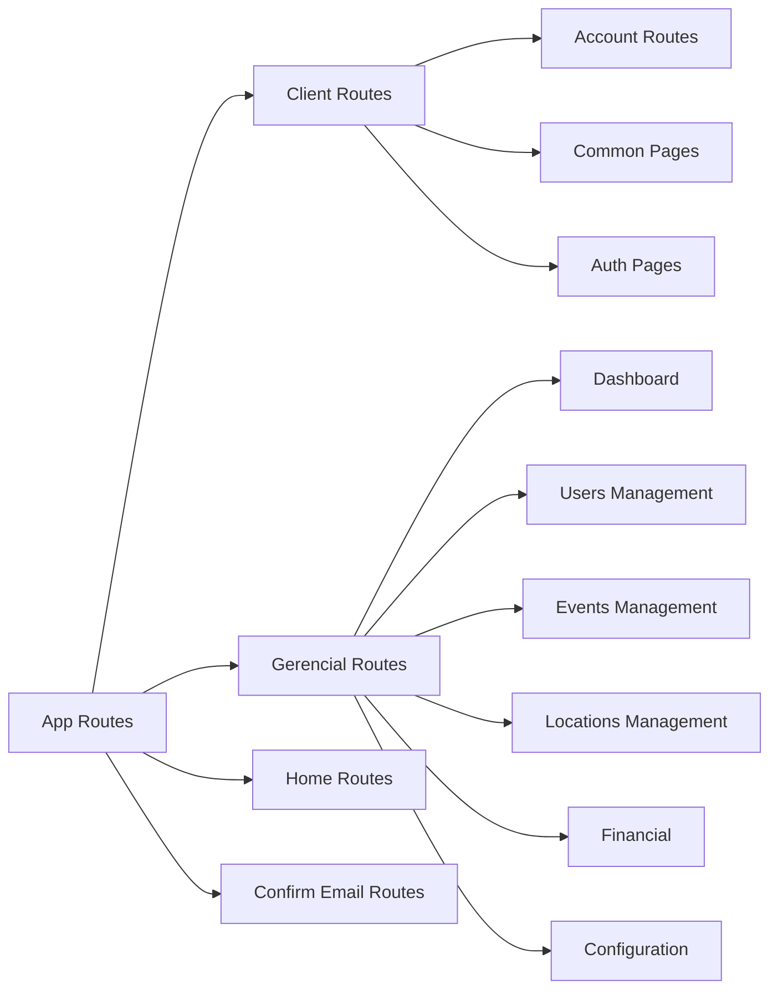
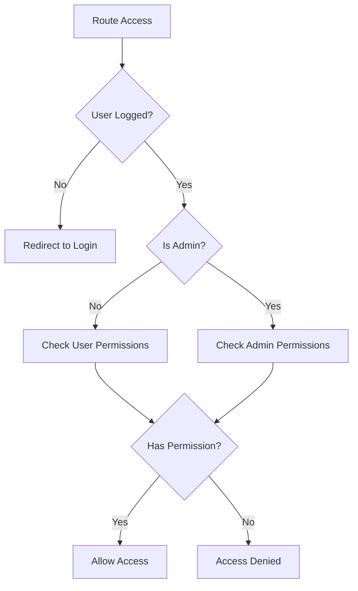
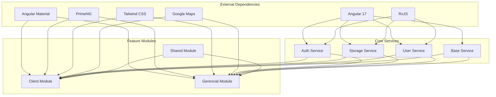

# Diagrama de Arquitetura - ATO Cultural Web

## 🏗️ Estrutura Modular

## 🔄 Fluxo de Rotas

## 🛡️ Sistema de Guards

## 📦 Estrutura de Dependências

## 🎯 Padrões de Desenvolvimento

### 1. **Separação de Responsabilidades**
- **Core**: Funcionalidades centrais e compartilhadas
- **Modules**: Funcionalidades específicas de negócio
- **Shared**: Componentes reutilizáveis

### 2. **Lazy Loading**
- Todos os módulos principais usam lazy loading
- Melhora a performance inicial da aplicação
- Reduz o bundle size

### 3. **Guards de Segurança**
- Verificação de autenticação
- Controle de permissões
- Proteção de rotas sensíveis

### 4. **Interceptors**
- Interceptação de requisições HTTP
- Tratamento de erros centralizado
- Adição automática de tokens de autenticação

### 5. **Serviços Base**
- Abstração de operações comuns
- Reutilização de código
- Facilita manutenção

---

*Estes diagramas ilustram a arquitetura e os padrões utilizados no projeto ATO Cultural Web.*
